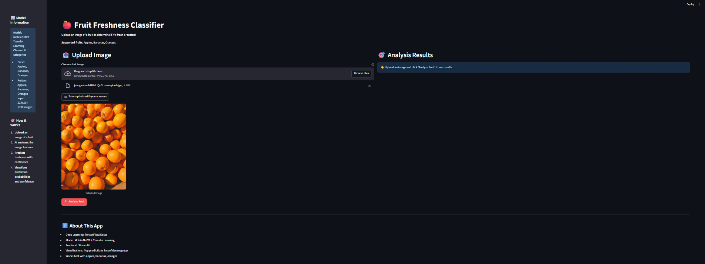
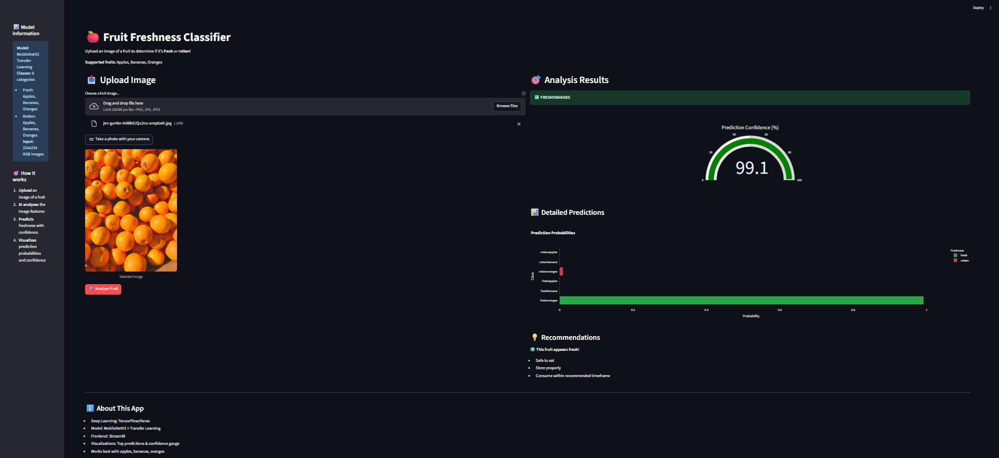

# 🍎 Fruit Freshness Classifier

[](https://www.python.org/downloads/)
[](https://tensorflow.org/)
[](https://streamlit.io/)
[](https://opensource.org/licenses/MIT)

An AI-powered web application that classifies fruit freshness using deep learning. Upload an image of an apple, banana, or orange, and the model will determine whether it's fresh or rotten with confidence scores and detailed visualizations.

## 🎯 Features

- **Real-time Fruit Classification**: Instantly classify fruits as fresh or rotten
- **Multiple Input Methods**: Upload images or use camera for live capture
- **Interactive Visualizations**: Confidence gauges and probability charts using Plotly
- **6 Fruit Categories**: Fresh & rotten apples, bananas, and oranges
- **Transfer Learning**: Built on MobileNetV2 for optimal performance
- **Class Imbalance Handling**: Weighted training for balanced predictions
- **User-friendly Interface**: Streamlit-powered responsive web app

## 🚀 Live Demo

[Try the app here](#) *(Will be updated after deployment)*

## 📸 Screenshots




## 🛠️ Technology Stack

- **Deep Learning**: TensorFlow 2.13+, Keras
- **Computer Vision**: OpenCV, PIL
- **Web Framework**: Streamlit
- **Data Science**: NumPy, Pandas, Scikit-learn
- **Visualizations**: Plotly, Matplotlib, Seaborn
- **Model Architecture**: MobileNetV2 + Transfer Learning

## 📦 Installation

### Prerequisites
- Python 3.8 or higher
- pip package manager
- Virtual environment (recommended)

### Step 1: Clone the Repository
```bash
git clone https://github.com/yourusername/fruit-freshness-classifier.git
cd fruit-freshness-classifier
```

### Step 2: Create Virtual Environment
```bash
python -m venv venv
# Windows
venv\Scripts\activate
# macOS/Linux
source venv/bin/activate
```

### Step 3: Install Dependencies
```bash
pip install -r requirements.txt
```

### Step 4: Run the Application
```bash
streamlit run streamlit_app.py
```

The app will open in your browser at `http://localhost:8501`

## 🏗️ Project Structure

```
fruit-freshness-classifier/
│
├── streamlit_app.py              # Main Streamlit application
├── Fruit_Freshness_Classifier.ipynb  # Training notebook
├── requirements.txt              # Python dependencies
├── fruit_freshness_model.h5      # Trained model (download separately)
├── README.md                     # Project documentation
│
├── dataset/                      # Dataset directory
│   ├── train/                    # Training images
│   │   ├── freshapples/
│   │   ├── freshbanana/
│   │   ├── freshoranges/
│   │   ├── rottenapples/
│   │   ├── rottenbanana/
│   │   └── rottenoranges/
│   └── test/                     # Test images
│       └── [same structure as train]
│
└── screenshots/                  # App screenshots
    ├── app_interface.png
    └── prediction_results.png
```

## 🤖 Model Architecture

The classifier uses **MobileNetV2** as the base model with transfer learning:

- **Base Model**: MobileNetV2 (pre-trained on ImageNet)
- **Input Size**: 224×224×3 RGB images
- **Classes**: 6 categories (3 fruits × 2 conditions)
- **Training Strategy**: Two-phase training with fine-tuning
- **Optimization**: Class weight balancing for imbalanced datasets

### Training Performance
- **Test Accuracy**: 85%+ (varies by dataset)
- **Training Time**: ~30 minutes on GPU
- **Model Size**: ~14MB (optimized for deployment)

## 📊 Dataset

The model was trained on a curated dataset of fruit images:
- **Total Images**: 6,000+ images
- **Categories**: Fresh and rotten apples, bananas, oranges
- **Preprocessing**: Data augmentation, normalization, resizing
- **Split**: 80% training, 20% validation

*Note: The dataset is not included in the repository due to size. Train your own model using the provided notebook.*

## 🔧 Usage

### Web Interface
1. Open the Streamlit app
2. Upload an image or use camera
3. Click "Analyze Fruit"
4. View results with confidence scores
5. See detailed probability breakdown

### Model Training
Run the Jupyter notebook `Fruit_Freshness_Classifier.ipynb` to:
- Analyze dataset distribution
- Train the model with your data
- Evaluate performance metrics
- Generate visualizations

### API Usage (Optional)
```python
import tensorflow as tf
from PIL import Image
import numpy as np

# Load model
model = tf.keras.models.load_model('fruit_freshness_model.h5')

# Preprocess image
image = Image.open('fruit_image.jpg')
img_array = np.array(image.resize((224, 224))) / 255.0
img_batch = np.expand_dims(img_array, axis=0)

# Predict
predictions = model.predict(img_batch)
class_names = ['freshapples', 'freshbanana', 'freshoranges', 
               'rottenapples', 'rottenbanana', 'rottenoranges']
predicted_class = class_names[np.argmax(predictions)]
```

## 🎨 Key Features Explained

### Class Imbalance Handling
The training script automatically detects and handles class imbalance using:
- Computed class weights
- Balanced sampling strategies
- Performance metrics per class

### Interactive Visualizations
- **Confidence Gauge**: Radial gauge showing prediction confidence
- **Probability Chart**: Horizontal bar chart of all class probabilities
- **Color Coding**: Green for fresh, red for rotten fruits

### Error Analysis
The training pipeline includes:
- Confusion matrix generation
- Misclassification analysis
- Per-class performance metrics

## 🚀 Deployment

### Streamlit Cloud (Recommended)
1. Fork this repository
2. Connect to [Streamlit Cloud](https://streamlit.io/cloud)
3. Deploy directly from GitHub
4. Share your app URL!

### Local Deployment
```bash
streamlit run streamlit_app.py --server.port 8501
```

### Docker Deployment
```dockerfile
FROM python:3.9-slim
WORKDIR /app
COPY requirements.txt .
RUN pip install -r requirements.txt
COPY . .
EXPOSE 8501
CMD ["streamlit", "run", "streamlit_app.py"]
```

## 🤝 Contributing

Contributions are welcome! Please feel free to submit a Pull Request. For major changes:

1. Fork the repository
2. Create a feature branch (`git checkout -b feature/AmazingFeature`)
3. Commit changes (`git commit -m 'Add AmazingFeature'`)
4. Push to branch (`git push origin feature/AmazingFeature`)
5. Open a Pull Request

## 📈 Future Enhancements

- [ ] Support for more fruit types (strawberries, grapes, etc.)
- [ ] Mobile app version using Flutter/React Native
- [ ] Batch processing for multiple images
- [ ] REST API endpoints
- [ ] Model quantization for edge deployment
- [ ] Real-time webcam integration
- [ ] Freshness timeline prediction

## 🐛 Known Issues

- Model performs best with clear, well-lit images
- Very dark or blurry images may reduce accuracy
- Background objects can sometimes affect predictions

## 📄 License

This project is licensed under the MIT License - see the [LICENSE](LICENSE) file for details.

## 👨‍💻 Author

**Your Name**
- GitHub: [isthatlak](https://github.com/isthatlak)
- LinkedIn: [Lakshay Bhandari](https://www.linkedin.com/in/lakshaybhandari/)
- Email: lakshaybofficial@gmail.com

## 🙏 Acknowledgments

- TensorFlow team for the excellent deep learning framework
- Streamlit for the amazing web app framework
- MobileNetV2 architecture by Google
- Open source community for inspiration and resources

## 📚 References

- [MobileNetV2: Inverted Residuals and Linear Bottlenecks](https://arxiv.org/abs/1801.04381)
- [Transfer Learning with TensorFlow](https://www.tensorflow.org/tutorials/images/transfer_learning)
- [Streamlit Documentation](https://docs.streamlit.io/)

---

⭐ **Star this repo if you found it helpful!** ⭐